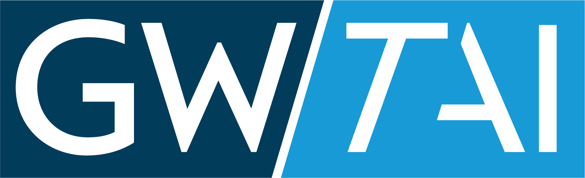

```{=html}
<header class="home-hero">
 <p class="home-hero-kicker"><a class="home-hero-logo" href="https://trustworthyai.gwu.edu" target="_blank" rel="noopener"></a>2026 Summer Workshop</p>
 <h1 class="home-hero-title">Agentic Workflows with <a class="home-hero-accent" href="https://code.claude.com/docs/en/quickstart#step-1-install-claude-code" target="_blank" rel="noopener">Claude Code</a></h1>
 <a class="intro-btn intro-btn-wide hero-register" href="https://www.youtube.com/watch?v=kX1bzUHZWqc" target="_blank" rel="noopener"><i class="bi bi-youtube"></i>Watch the Recording</a>
</header>
```





<div class="soft-divider"></div>

## Part 0: [Setup](setup.qmd)



## Part 1: [Agentic Basics](basics.qmd)



## Part 2: [Skill Usage and Design](skills.qmd)



## Part 3: [Working Safely with Data and AI](safety.qmd)


